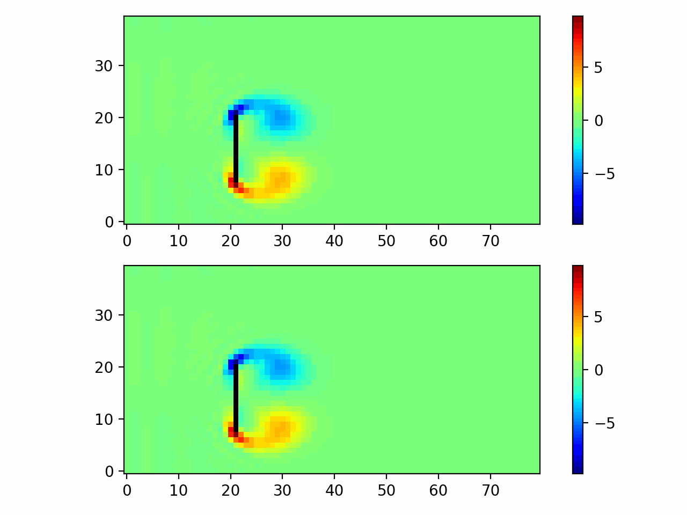

# FluidNet: 2D Viscous Flow Simulation Using CNN

This project leverages a Convolutional Neural Network (CNN) to simulate 2D viscous flow, with the target being the lattice Boltzmann algorithm (LBA). It demonstrates how deep learning can be applied to simulate complex fluid dynamics processes by learning from data generated by a lattice Boltzmann solver.

## Overview

- **Objective**: Train a CNN model (FluidNet) to predict the flow field of a 2D viscous fluid.
- **Dataset**: The dataset is generated using a custom `GenerateFlowData` class, which creates samples of fluid flow data using a Lattice Boltzmann method.
- **Model**: The `FluidNet` model takes flow data as input and predicts fluid properties such as velocity and density at each timestep.
- **Loss Function**: Mean Squared Error (MSE) loss with masking to ignore regions with very small velocities.
- **Training**: The model is trained using the Adam optimizer and early stopping based on validation loss.
- **Visualization**: After training, the model's predictions are animated as GIFs for visual inspection.

## Project Structure

- **animate.py**: # Functions to animate fluid flow simulation results
- **generate_data.py**: # Generates training data using Lattice Boltzmann Method
- **models.py**: # FluidNet model definition
- **train.py**: # Main training script for FluidNet
- **flow_animationX.gif**: # Example of generated flow animations (GIFs)
- **fluid_model.pth**: # Saved model after training  
- **README.md**: # Project documentation

